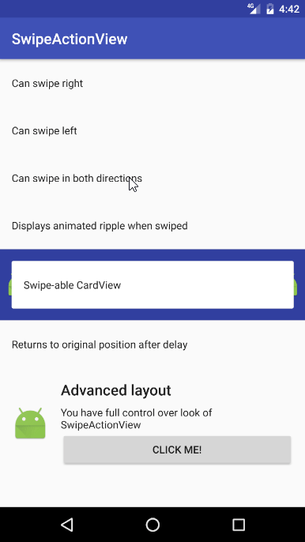

# Swipe Action View

[](https://travis-ci.org/Tunous/SwipeActionView)
[](https://jitpack.io/#Tunous/SwipeActionView)
[](https://android-arsenal.com/details/1/5250)

SwipeActionView is a swipe-able view, which allows users to perform actions by swiping it to the left or right side.

# Table of contents
- [Preview](#preview)
- [Installation](#installation)
- [Quick Example](#quick-example)
- [Sample](#sample)
- [The idea](#idea)
  - [Container](#container)
  - [Background views](#bg-views)
- [Gesture listener](#gesture-listener)
- [Disabling gestures](#disabling-gestures)
- [Ripple animations](#ripple-animations)
- [Click listeners](#click-listeners)
- [Attributes](#attr)
  - [sav_alwaysDrawBackground](#attr-alwaysDrawBackground)
  - [sav_rippleTakesPadding](#attr-rippleTakesPadding)
  - [sav_swipeLeftRippleColor](#attr-swipeLeftRippleColor)
  - [sav_swipeRightRippleColor](#attr-swipeRightRippleColor)
  - [Tools attributes](#attr-tools)
    - [sav_tools_previewBackground](#attr-tools-previewBackground)
    - [sav_tools_previewRipple](#attr-tools-previewRipple)
- [Animations](#animations)
- [Credits](#credits)
- [License](#license)

# <a id="preview">Preview</a>



# <a id="installation">Installation</a>

Add the JitPack repository to your root `build.gradle`:
```groovy
allprojects {
    repositories {
        maven { url "https://jitpack.io" }
    }
}
```

And add the dependency in your module's `build.gradle`:
```groovy
dependencies {
    compile 'com.github.Tunous:SwipeActionView:1.0.0'
}
```

# <a id="quick-example">Quick example</a>

Adding `SwipeActionView` to your projects requires only adding it to XML and setting up `SwipeGestureListener`.
Below example will create `TextView` that can be swiped both to the left or right side with two icons behind.

```xml
<me.thanel.swipeactionview.SwipeActionView
    android:id="@+id/swipe_view"
    android:layout_width="match_parent"
    android:layout_height="wrap_content"
    android:background="?colorPrimary">

    <ImageView
        android:layout_width="24dp"
        android:layout_height="24dp"
        android:src="@mipmap/ic_launcher"/>

    <ImageView
        android:layout_width="24dp"
        android:layout_height="24dp"
        android:layout_gravity="end"
        android:src="@mipmap/ic_launcher"/>
        
    <TextView
        android:layout_width="match_parent"
        android:layout_height="wrap_content"
        android:padding="16dp"
        android:text="Swipe me"/>
</me.thanel.swipeactionview.SwipeActionView>
```

```java
SwipeActionView swipeView = (SwipeActionView) findViewById(R.id.swipe_view);

swipeView.setSwipeGestureListener(new SwipeGestureListener() {
    @Override
    public boolean onSwipedLeft(@NotNull SwipeActionView swipeActionView) {
        showToast("Swiped left");
        return true;
    }

    @Override
    public boolean onSwipedRight(@NotNull SwipeActionView swipeActionView) {
        showToast("Swiped right");
        return true;
    }
});
```

# <a id="sample">Sample</a>
For an example implementation of `SwipeActionView` see the included [sample] project.

You can manually compile the apk using source code or download from the [releases page] of this repository.

# <a id="idea">The idea</a>
The main idea behind this library is a concept of [container] and [background views]. It allows for complete control over the look of the created views. 

In the [quick example](#quick-example) section you can see that the `SwipeActionView` has three child views. The first two are [background views], and the last one is the [container]. To create working version of `SwipeActionView`, you are only required to specify single background view and container. Second background view can be added when you want to be able to swipe in both directions. 

### <a id="container">Container</a>
The container is a view which is drawn above other views. In the default state, this is the only visible view, and it is what gets moved when users perform swipe gestures. It can be either a simple `TextView`, custom view or even some sort of view group like `LinearLayout`. There is no limit for that, which allows you to gain complete control over the look of your views. 

### <a id="bg-views">Background views</a>
Background views are the mostly invisible part of `SwipeActionView`. They get revealed only when users start performing swipe gestures. 

You can specify for which swipe direction each of them corresponds by setting their `layout_gravity` attribute. 
Default value or setting it to either `left` and/or `start` means that it will start appearing when users perform right swipe gesture. On the other hand setting it to `end` and/or `right` will result in the view to start appearing when users swipe to the left. This doesn't mean that you aren't allowed to use other `layout_gravity` options like `center`. They will still control the view as usual and will be ignored by `SwipeActionView`. 

This behavior allows you to add single background and by specifying its `layout_gravity` determine whether `SwipeActionView` should be possible to be swiped only to the left or right side.

**Note:** There can be only one view for each direction. This means that if one of them is placed on the left side, the second one must be put on the right side to avoid errors.

### <a id="idea-example">Example</a>

```xml
<me.thanel.swipeactionview.SwipeActionView
    android:id="@+id/swipe_view"
    android:layout_width="match_parent"
    android:layout_height="wrap_content"
    android:background="?colorPrimary">

    <!-- First background view.
        It will be located on left side of the view and will allow users to perform
        right swipe gesture. -->
    <ImageView
        android:layout_width="24dp"
        android:layout_height="24dp"
        android:src="@mipmap/ic_launcher"/>

    <!-- Second background view.
        This one will be located on the right side and allow users to perform
        left swipe gesture as its layout_gravity is changed to "end". -->
    <ImageView
        android:layout_width="24dp"
        android:layout_height="24dp"
        android:layout_gravity="end"
        android:src="@mipmap/ic_launcher"/>
        
    <!-- Container.
        This is what users will see when the view is not being swiped. -->
    <TextView
        android:layout_width="match_parent"
        android:layout_height="wrap_content"
        android:padding="16dp"
        android:text="Swipe me"/>
</me.thanel.swipeactionview.SwipeActionView>
```

# <a id="gesture-listener">Gesture listener</a>
In order to be able to perform actions when users swipe the `SwipeActionView` you have to setup the listener with the `setSwipeGestureListener(SwipeGestureListener)` method. It takes `SwipeGestureListener` as a parameter.

`SwipeGestureListener` consists of two methods. One for performing an action when the view is swiped to the left and one when it is swiped to the right side.

Each of these methods returns `Boolean` as a result. Most of the time you'll want to return `true` here. Returning `false` is designed for advanced usage. By doing so, the view won't be automatically animated to the original position but will stay at the full translation. This allows you to manipulate the content of the visible background view. One great example of this is displaying progress wheel and manually returning the view to the original position once some long action finishes execution.

To return the view to its original position you can call the `moveToOriginalPosition()` method at any time.

```java
swipeView.setSwipeGestureListener(new SwipeGestureListener() {
    @Override
    public boolean onSwipedLeft(@NotNull SwipeActionView swipeActionView) {
        showToast("Swiped left");

        // Returning true automatically moves view to original position
        return true;
    }

    @Override
    public boolean onSwipedRight(@NotNull SwipeActionView swipeActionView) {
        showToast("Swiped right");
        
        // Returning false requires calling moveToOriginalPosition() manually to
        // reset view to original position

        // Here we are using optional parameter which will move our view to
        // original position after delay in ms. In this case it's 2s.
        swipeActionView.moveToOriginalPosition(2000);

        return false;
    }
});
```

# <a id="disabling-gestures">Disabling gestures</a>
If you want to dynamically enable or disable gesture in a specific direction you can use the `setDirectionEnabled(SwipeDirection, Boolean)` method.
 
**Note:** The gesture enabling part is controlled by presence and visibility of background views. This method is only provided for convenience since it can also be changed by switching visibility of background views. It was coded like this so the specific swipe directions can be disabled by default from XML using `visibility` attribute on views corresponding to these directions.


```java
swipeView.setDirectionEnabled(SwipeDirection.Left, false);
```

# <a id="ripple-animations">Ripple animations</a>
`SwipeActionView` comes with optional support for displaying ripple animations when gestures are performed. All you have to do to enable them is to give them a color from XML or code. To do so from the code, you can use the `setRippleColor(SwipeDirection, Int)` method. 

To disable ripple animations you can enter `-1` as value for color.

```java
swipeView.setRippleColor(SwipeDirection.Right, Color.BLUE);
```

# <a id="click-listeners">Click listeners</a>
`SwipeActionView` makes sure that any click listeners will work correctly. You can use `setClickListener(View.OnClickListener)` as usual and they should work, including views located in the container.

The only exception is that you shouldn't add click listeners for background views. This library wasn't designed to add support for this behavior. If it's possible then, that's only a positive side effect. You are better of with using libraries such as [AndroidSwipeLayout] instead.

# <a id="attr">Attributes</a>

#### <a id="attr-alwaysDrawBackground">`app:sav_alwaysDrawBackground="true|false"`</a>
To reduce overdraw `SwipeActionView` only draws parts of the main background and background views which become visible due to swipe gesture. This is not always what you want as it could break any container views with transparency. A good example where you would want to use this attribute is when you had `CardView` as your container.

#### <a id="attr-rippleTakesPadding">`app:sav_rippleTakesPadding="true|false"`</a>
If you want ripple effect to take padding together with container view you can set this attribute to true.

#### <a id="attr-swipeLeftRippleColor">`app:sav_swipeLeftRippleColor="@color"`</a>
Sets color for ripple displayed when users swipe left.

#### <a id="attr-swipeRightRippleColor">`app:sav_swipeRightRippleColor="@color"`</a>
Sets color for ripple displayed when users swipe right.

## <a id="attr-tools">Tools attributes</a>
`SwipeActionView` has special attributes used only in the editor mode. They make it possible to preview ripples or contents of background views without worrying about side effects. They are entirely ignored when running on the device.

#### <a id="attr-tools-previewBackground">`app:sav_tools_previewBackground="swipeLeft|swipeRight"`</a>
Shows background view for swipe left or right gesture. 

#### <a id="attr-tools-previewRipple">`app:sav_tools_previewRipple="swipeLeft"`</a>
Shows ripple for swipe left or right gesture. 

# <a id="animations">Animations</a>
`SwipeActionView` also comes with support for custom animations. There are two listeners that you can set in your code. They will be called with current swipe progress while users perform swipe gesture.

By default, there is only one animator included which scales the background views. You can use it as an example of how to implement custom animations or use it directly if it's good enough for you.

# <a id="credits">Credits</a>
This library wouldn't be created without help and work of [Brian Robles].

His [KarmaMachine] Reddit application was my direct inspiration when I was creating it for my application.
He also created `SwipeRippleDrawable` and allowed me to [reimplement][SwipeRippleDrawable] it for purposes of this library.
**Huge thanks!**

# <a id="license">License</a>
```
Copyright © 2016-2017 Łukasz Rutkowski

Licensed under the Apache License, Version 2.0 (the "License");
you may not use this file except in compliance with the License.
You may obtain a copy of the License at

   http://www.apache.org/licenses/LICENSE-2.0

Unless required by applicable law or agreed to in writing, software
distributed under the License is distributed on an "AS IS" BASIS,
WITHOUT WARRANTIES OR CONDITIONS OF ANY KIND, either express or implied.
See the License for the specific language governing permissions and
limitations under the License.
```

[sample]: https://github.com/Tunous/SwipeActionView/tree/master/sample
[releases page]: https://github.com/Tunous/SwipeActionView/releases
[container]: #container
[background views]: #bg-views
[AndroidSwipeLayout]: https://github.com/daimajia/AndroidSwipeLayout
[Brian Robles]: https://github.com/brianrobles204
[KarmaMachine]: https://play.google.com/store/apps/details?id=com.brianrobles204.karmamachine
[SwipeRippleDrawable]: https://github.com/Tunous/SwipeActionView/blob/master/library/src/main/kotlin/me/thanel/swipeactionview/SwipeRippleDrawable.kt
